# Daily Expense & Budget Logger (Enterprise Edition)
**Enterprise Project Handbook & Academic Submission Dossier**

* **Author**: Chandan Raj
* **Technology Stack**: React.js, Spring Boot 3, PostgreSQL, Spring Security, JWT, Tailwind CSS, Axios, SMTP Async Mailer
* **Submission Date**: July 2, 2026
* **Project Version**: v1.0.0 (Enterprise Edition)
* **Document Status**: Production-Grade Release & Viva-Ready

---

# 1. Project Introduction

## Overview & System Purpose
The **Daily Expense & Budget Logger (Enterprise Edition)** is an enterprise-grade financial control and monitoring platform designed to orchestrate team and corporate-level expense tracking, budget enforcement, and immutable audit trailing. In contemporary enterprises, unstructured expense claims, late budget threshold alerts, and lack of accountability lead to financial leakage and audit failures. This system addresses these issues by offering automated budget compliance checks, multi-tiered role authorization, and asynchronous notifications.

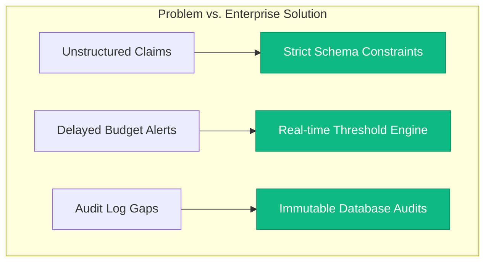
```mermaid
graph TD
    subgraph CoreGoal [Problem vs. Enterprise Solution]
        Problem1["Unstructured Claims"] --> Sol1["Strict Schema Constraints"]
        Problem2["Delayed Budget Alerts"] --> Sol2["Real-time Threshold Engine"]
        Problem3["Audit Log Gaps"] --> Sol3["Immutable Database Audits"]
    end
    style Sol1 fill:#10b981,stroke:#059669,color:#fff
    style Sol2 fill:#10b981,stroke:#059669,color:#fff
    style Sol3 fill:#10b981,stroke:#059669,color:#fff
```

## Objectives, Scope & Target Users
* **Objectives**: 
  1. Eliminate expense claim processing delays via a unified RESTful web service.
  2. Implement mathematical boundary checks ensuring zero tolerance for decimal rounding discrepancies.
  3. Guarantee full historical logging of administrative actions to meet strict regulatory audits.
* **Scope**: The system covers full secure registration, token-based session verification with rotation, real-time expense classification, multi-interval budget limits, and background cleanup operations.
* **Target Users**: Corporate Employees (standard tracking), Financial Officers/Auditors (compliance checks), and IT Administrators (user status and role hierarchy controls).

---

### Architectural Evaluation
* **Why it exists**: The system is designed to provide organizations with a single source of truth for financial operations, replacing ad-hoc spreadsheets with transactional database schemas.
* **How it works**: Standard users log expenses, which pass through runtime DTO constraint checks. The budget engine calculates whether the category expense exceeds the user's allocated limit and triggers a background email notification if a violation occurs.
* **Why it is scalable**: The domain models decouple financial computation from database transactions, allowing calculations to scale horizontally without locking Postgres tables.
* **Why it is secure**: The ingress path blocks unauthenticated requests at the API boundary using JWT verification and matches the caller's ID directly from the authentication context.
* **Why it is maintainable**: Clean business domain models isolate financial operations from the presentation layer, letting developers update client styles without affecting ledger consistency.

---

# 2. Technology Stack

The enterprise platform leverages a split-tier technology stack optimized for high concurrency, stateless API communication, and relational consistency.

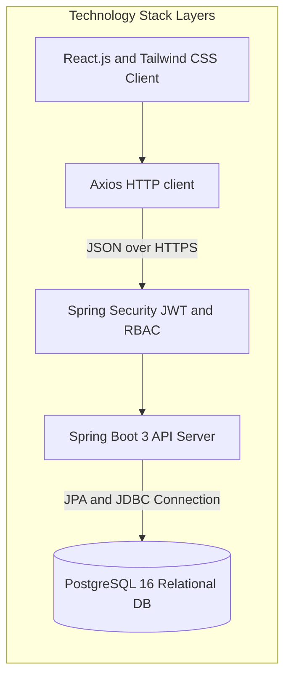
```mermaid
graph LR
    subgraph TechLayers [Technology Stack Layers]
        ViteReact["React.js and Tailwind CSS Client"]
        AxiosClient["Axios HTTP client"]
        SpringBoot3["Spring Boot 3 API Server"]
        SpringSec["Spring Security JWT and RBAC"]
        PostgresDB[(PostgreSQL 16 Relational DB)]
    end
    ViteReact --> AxiosClient
    AxiosClient -- "JSON over HTTPS" --> SpringSec
    SpringSec --> SpringBoot3
    SpringBoot3 -- "JPA and JDBC Connection" --> PostgresDB
```

## Stack Component Details
### Frontend
* **React.js (v18)**: Chosen for its virtual DOM rendering efficiency and stateful hooks, allowing the system to update analytics in real-time without performing full-page refreshes.
* **Tailwind CSS**: Utilized to rapidly build utility-first, fully responsive layouts, achieving modern look-and-feel variables (like glassmorphism and dark mode) without custom CSS bloat.
* **Context API**: Employed to manage global authentication, theme variations, and toast notification queues, avoiding prop-drilling.
* **Axios**: Standardized for promise-based HTTP network calls, using custom interceptors to automatically attach JWT authorization headers and process global errors.
* **React Router (v6)**: Selected for client-side single-page routing, allowing declarative path configuration and route guard integration.

### Backend
* **Spring Boot 3**: Selected as the core enterprise framework due to its configuration patterns, built-in dependency injection container, and compatibility with Java 21 features.
* **Spring Security**: Configured to construct the security filter chain, intercepting requests and validating roles at the class and method levels.
* **JWT Authentication**: Implemented to support stateless API interactions, eliminating the need to store session states on the server.
* **JPA/Hibernate**: Used to map database tables to Java domain entities, guaranteeing object-relational mapping consistency.
* **Maven**: Utilized for dependency lifecycle tracking and builds.

### Database
* **PostgreSQL**: Implemented to guarantee ACID transaction properties, enabling safe updates to budgets and expense tables concurrently.

### Security
* **Role-Based Access Control (RBAC)**: Maps granular permissions to roles, controlling visibility of resources on the client and API endpoints on the backend.
* **JWT Tokens**: Employs double token structures (Access Token + Refresh Token) with database-backed rotation rules.
* **Password Encryption**: Hashed using BCrypt with a work factor of 12.
* **Route Protection**: Employs client-side guards and server-side annotations.

### Infrastructure
* **Async Processing**: Utilizes `@Async` and thread pool configurations to handle non-blocking processes.
* **Scheduler Jobs**: Employs Spring's `@Scheduled` annotation to run automatic database cleanup.
* **SMTP Email Infrastructure**: Interacts with SMTP servers to transmit threshold alerts.

---

### Architectural Evaluation
* **Why it exists**: Choosing these frameworks ensures we leverage modern, tested security protocols and standard patterns instead of coding custom, vulnerable solutions.
* **How it works**: The user interface interacts via Axios with Spring Boot controllers, which execute transactions against PostgreSQL using Hibernate.
* **Why it is scalable**: The stateless nature of the Spring Boot REST endpoints enables scaling by launching multiple instances behind a load balancer.
* **Why it is secure**: The stack relies on BCrypt for credential hashing and JPA-level database converters for column encryption.
* **Why it is maintainable**: Maven separates dependencies cleanly, and React splits user interface concerns from core business routing.

---

# 3. High-Level System Architecture

The high-level system architecture details the system components across the clients, security gates, application nodes, database instances, and external networks.

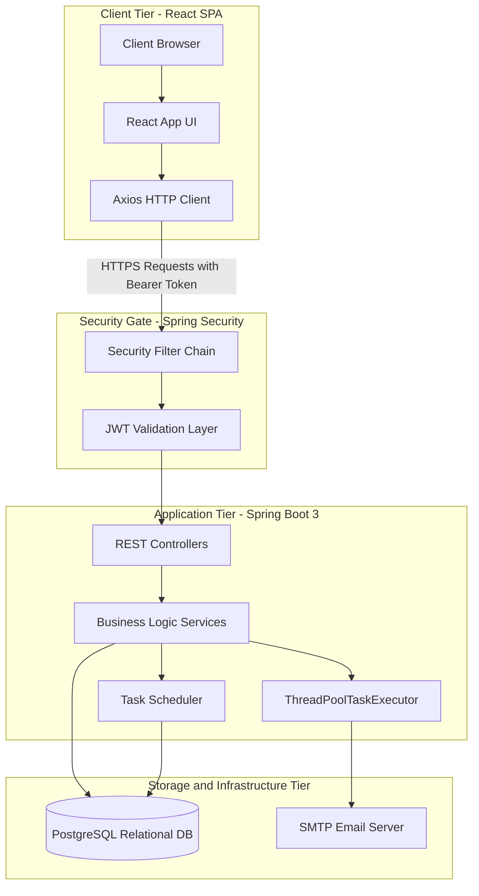
```mermaid
graph TD
    subgraph ClientTier [Client Tier - React SPA]
        Browser[Client Browser]
        ReactFE[React App UI]
        Axios[Axios HTTP Client]
    end

    subgraph SecurityGate [Security Gate - Spring Security]
        SecurityFilter[Security Filter Chain]
        JwtAuth[JWT Validation Layer]
    end

    subgraph AppTier [Application Tier - Spring Boot 3]
        Controllers[REST Controllers]
        Services[Business Logic Services]
        AsyncExec[ThreadPoolTaskExecutor]
        Scheduler[Task Scheduler]
    end

    subgraph StorageTier [Storage and Infrastructure Tier]
        Postgres[(PostgreSQL Relational DB)]
        Smtp[SMTP Email Server]
    end

    Browser --> ReactFE
    ReactFE --> Axios
    Axios -- "HTTPS Requests with Bearer Token" --> SecurityFilter
    SecurityFilter --> JwtAuth
    JwtAuth --> Controllers
    Controllers --> Services
    Services --> Postgres
    Services --> AsyncExec
    Services --> Scheduler
    AsyncExec --> Smtp
    Scheduler --> Postgres
```

## Components and Data Flow Overview
1. **Presentation Entry**: Client requests originate in the user browser and trigger state transitions within React.
2. **Network Transport**: Axios transforms local actions to JSON payloads, automatically attaching access tokens, and shoots them to the server.
3. **Security Interception**: Spring Security intercepts the requests, extracts the token, verifies the cryptographic signature, and sets the authentication context.
4. **Endpoint Delegation**: Controllers route validated DTO parameters to services, which run calculations and mutate the PostgreSQL database.
5. **Decoupled Execution**: Long-running SMTP triggers are offloaded to `ThreadPoolTaskExecutor`, and cleanup jobs run on the `Task Scheduler`.

---

### Architectural Evaluation
* **Why it exists**: This multi-tier architecture prevents the client from directly interacting with PostgreSQL database connections, safeguarding raw data from unauthorized access.
* **How it works**: Requests flow from the client browser through security filters, controllers, and services, culminating in a transaction written to PostgreSQL.
* **Why it is scalable**: Database and application servers can be separated. The application server is stateless, allowing for horizontal auto-scaling.
* **Why it is secure**: The database resides in a private subnet, rejecting direct public queries and requiring all operations to route through Spring's security boundaries.
* **Why it is maintainable**: The layers use clean REST boundaries. The frontend can be swapped or rebuilt without altering the database schema or services.

---

# 4. Frontend Architecture

The React.js single-page application is structured as a modular, component-driven hierarchy, prioritizing page loading speeds and decoupling UI layouts from network integrations.

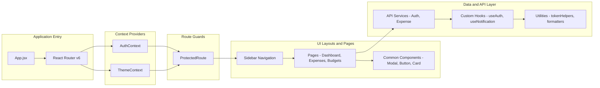
```mermaid
graph LR
    subgraph AppEntry [Application Entry]
        App["App.jsx"]
        Router["React Router v6"]
    end

    subgraph GlobalContexts [Context Providers]
        AuthCtx["AuthContext"]
        ThemeCtx["ThemeContext"]
    end

    subgraph RouteGuards [Route Guards]
        ProtectedRoute["ProtectedRoute"]
    end

    subgraph UIModules [UI Layouts and Pages]
        Sidebar["Sidebar Navigation"]
        Pages["Pages - Dashboard, Expenses, Budgets"]
        Components["Common Components - Modal, Button, Card"]
    end

    subgraph IntegrationLayer [Data and API Layer]
        Services["API Services - Auth, Expense"]
        Hooks["Custom Hooks - useAuth, useNotification"]
        Utils["Utilities - tokenHelpers, formatters"]
    end

    App --> Router
    Router --> AuthCtx
    Router --> ThemeCtx
    AuthCtx --> ProtectedRoute
    ThemeCtx --> ProtectedRoute
    ProtectedRoute --> Sidebar
    Sidebar --> Pages
    Pages --> Components
    Pages --> Services
    Services --> Hooks
    Hooks --> Utils
```

## Client Design Principles
* **State Isolation**: Context API manages global states (e.g., login tokens, themes), while local component states (`useState`) handle simple user inputs.
* **Dynamic Import (Lazy Loading)**: Page layouts (e.g., `AuditLogsPage`) are imported using `React.lazy()` and wrapped in `Suspense` tags, reducing the initial JavaScript payload size.
* **API Client Abstraction**: Centralized services isolate Axios calls, handling serialization and network exceptions away from presentational rendering code.
* **Responsive Layouts**: Responsive navigation is driven by Tailwind breakpoints, optimizing user experience across screen widths.

---

### Architectural Evaluation
* **Why it exists**: Separating presentational UI components from API network services ensures that UI changes do not break communication contracts with backend APIs.
* **How it works**: The user interface triggers actions via customized Hooks. These hooks fetch data using Axios services, update React contexts, and re-render visual components.
* **Why it is scalable**: The application leverages lazy loading, partitioning the frontend code into bundles that are loaded only when requested.
* **Why it is secure**: Token checks are performed before routes are mounted, preventing unauthorized templates from rendering in the DOM.
* **Why it is maintainable**: Reusable elements are extracted into a common component folder, making updates straightforward.

---

# 5. Backend Architecture

The backend is constructed using a strictly layered architecture that enforces unidirectional dependency injection, separating network serialization, business logic validation, and database operations.

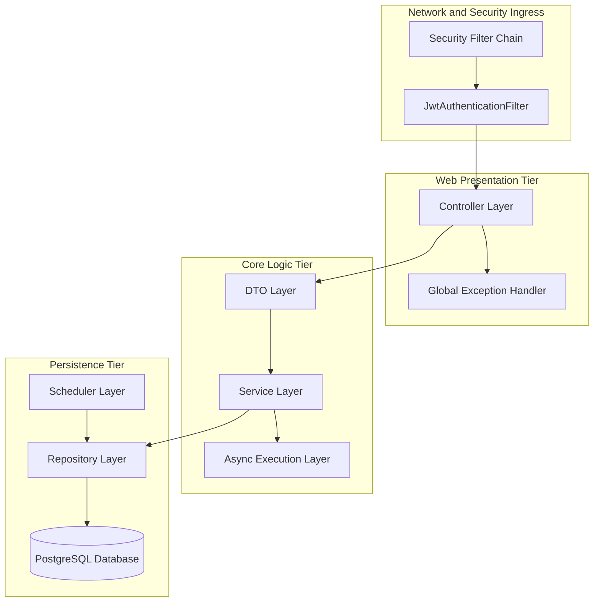
```mermaid
graph TD
    subgraph Ingress [Network and Security Ingress]
        SecurityChain["Security Filter Chain"]
        JwtFilter["JwtAuthenticationFilter"]
    end

    subgraph WebBoundary [Web Presentation Tier]
        Controller["Controller Layer"]
        ExceptionAdvice["Global Exception Handler"]
    end

    subgraph LogicBoundary [Core Logic Tier]
        Dto["DTO Layer"]
        Service["Service Layer"]
        Async["Async Execution Layer"]
    end

    subgraph PersistBoundary [Persistence Tier]
        Repository["Repository Layer"]
        Scheduler["Scheduler Layer"]
        Postgres[(PostgreSQL Database)]
    end

    SecurityChain --> JwtFilter
    JwtFilter --> Controller
    Controller --> Dto
    Controller --> ExceptionAdvice
    Dto --> Service
    Service --> Repository
    Service --> Async
    Scheduler --> Repository
    Repository --> Postgres
```

## Backend Layer Responsibilities
* **Security Filter Chain**: Intercepts HTTP calls, validating JWT signatures before routing payloads to REST endpoints.
* **Controller Layer**: Deserializes JSON payloads to DTOs, executes Spring `@Valid` constraints, and maps service outputs to HTTP statuses.
* **Service Layer**: Coordinates business processes, evaluates financial limits, and executes updates within `@Transactional` boundaries.
* **Repository Layer**: Generates optimized queries and interacts directly with PostgreSQL.
* **Global Exception Handler**: Intercepts application exceptions, returning standardized JSON error payloads.

---

### Architectural Evaluation
* **Why it exists**: The layered structure isolates each layer's responsibilities, preventing database code from leaking into HTTP controllers.
* **How it works**: Network requests pass through authentication filters to the controllers. The payload is validated, routed to services, written to repositories, and returned as a secure DTO.
* **Why it is scalable**: The service layer can be decoupled from the persistence layer, enabling the implementation of cache layers without rewriting API controllers.
* **Why it is secure**: The database is separated from the entry controller, and transactions are committed only when service validation succeeds.
* **Why it is maintainable**: Endpoints are defined using standard Spring patterns, enabling developers to modify database structures without breaking client APIs.

---

# 6. Authentication & Authorization Architecture

## JWT Lifecycle

Stateless user session verification is implemented using a dual-token architecture that combines short-lived Access Tokens (15 minutes) with long-lived, database-backed Refresh Tokens (7 days).

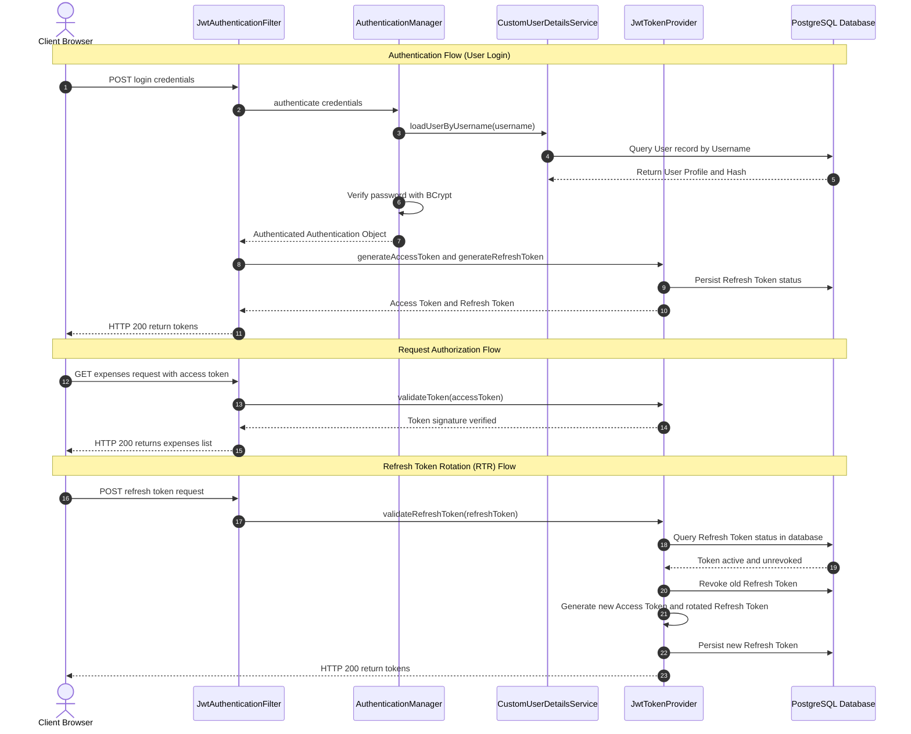
```mermaid
sequenceDiagram
    autonumber
    actor User as Client Browser
    participant Filter as JwtAuthenticationFilter
    participant AuthManager as AuthenticationManager
    participant UserDetailsService as CustomUserDetailsService
    participant TokenProvider as JwtTokenProvider
    participant DB as PostgreSQL Database

    Note over User, DB: Authentication Flow (User Login)
    User->>Filter: POST login credentials
    Filter->>AuthManager: authenticate credentials
    AuthManager->>UserDetailsService: loadUserByUsername(username)
    UserDetailsService->>DB: Query User record by Username
    DB-->>UserDetailsService: Return User Profile and Hash
    AuthManager->>AuthManager: Verify password with BCrypt
    AuthManager-->>Filter: Authenticated Authentication Object
    Filter->>TokenProvider: generateAccessToken and generateRefreshToken
    TokenProvider->>DB: Persist Refresh Token status
    TokenProvider-->>Filter: Access Token and Refresh Token
    Filter-->>User: HTTP 200 return tokens

    Note over User, DB: Request Authorization Flow
    User->>Filter: GET expenses request with access token
    Filter->>TokenProvider: validateToken(accessToken)
    TokenProvider-->>Filter: Token signature verified
    Filter-->>User: HTTP 200 returns expenses list

    Note over User, DB: Refresh Token Rotation (RTR) Flow
    User->>Filter: POST refresh token request
    Filter->>TokenProvider: validateRefreshToken(refreshToken)
    TokenProvider->>DB: Query Refresh Token status in database
    DB-->>TokenProvider: Token active and unrevoked
    TokenProvider->>DB: Revoke old Refresh Token
    TokenProvider->>TokenProvider: Generate new Access Token and rotated Refresh Token
    TokenProvider->>DB: Persist new Refresh Token
    TokenProvider-->>User: HTTP 200 return tokens
```

## Security Mechanism Details
* **Cryptographic Signatures**: Access tokens are signed using the HMAC-SHA512 algorithm, verified by a base64-encoded secret key on the backend.
* **Refresh Token Rotation (RTR)**: Each token refresh operation revokes the old refresh token and issues a new one. If a revoked token is reuse-attempted, the backend detects the breach, revokes the user's current token lineage, and prompts for re-authentication.

---

### Architectural Evaluation
* **Why it exists**: Stateless JWT authentication allows the backend to handle requests without maintaining session states in memory, mitigating memory leaks and session fixation attacks.
* **How it works**: The user logs in to receive an access token and a refresh token. Subsequent requests present the access token. Expired access tokens are refreshed using the rotation endpoint.
* **Why it is scalable**: Validating the access token is a cryptographic operations that requires no database lookups, reducing query overhead during traffic spikes.
* **Why it is secure**: Database-backed refresh tokens allow administrators to instantly revoke user sessions by setting the token status to revoked.
* **Why it is maintainable**: Token generation and parsing are centralized in the `JwtTokenProvider` class, making updates to security algorithms straightforward.

---

# 7. RBAC Architecture

The application implements Role-Based Access Control (RBAC) to enforce administrative and audit restrictions on both the React client interface and Spring Boot controllers.

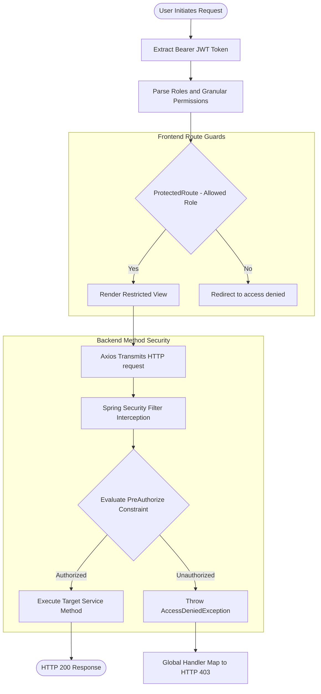
```mermaid
flowchart TD
    Request([User Initiates Request]) --> GetJWT[Extract Bearer JWT Token]
    GetJWT --> ParseClaims[Parse Roles and Granular Permissions]
    
    subgraph FrontendAuthorization [Frontend Route Guards]
        FECheck{ProtectedRoute - Allowed Role}
        FECheck -- Yes --> MountUI[Render Restricted View]
        FECheck -- No --> DenyUI[Redirect to access denied]
    end
    
    subgraph BackendAuthorization [Backend Method Security]
        AxiosReq[Axios Transmits HTTP request]
        FilterCheck[Spring Security Filter Interception]
        PreAuthCheck{Evaluate PreAuthorize Constraint}
        PreAuthCheck -- Authorized --> ExecService[Execute Target Service Method]
        PreAuthCheck -- Unauthorized --> ThrowException[Throw AccessDeniedException]
    end

    ParseClaims --> FECheck
    MountUI --> AxiosReq
    AxiosReq --> FilterCheck
    FilterCheck --> PreAuthCheck
    ExecService --> SuccessResponse([HTTP 200 Response])
    ThrowException --> GlobalErrorAdvice[Global Handler Map to HTTP 403]
```

## Authorization Principles
* **Granular Permissions**: Roles map to discrete permissions (e.g., `write:user_management`, `read:system_logs`) to avoid hardcoding role-based checks.
* **Method Security**: Backend controllers use Spring Security's `@PreAuthorize` annotation, evaluating incoming JWT claims against the controller method requirements before execution.

---

### Architectural Evaluation
* **Why it exists**: Granular permissions provide flexible access control. If administrative roles are updated, permissions can be reassigned in the database without modifying the codebase.
* **How it works**: User permissions are embedded in the JWT payload upon login. The client UI filters pages using these claims, while the backend verifies permissions on interceptor filters.
* **Why it is scalable**: Permissions are verified using claims parsed from the JWT in memory, preventing redundant user role database queries during requests.
* **Why it is secure**: Backend security checks run independently of the frontend, preventing users from accessing API endpoints even if they bypass client-side route guards.
* **Why it is maintainable**: Permissions are mapped to controller methods using clear annotations, simplifying security audits.

---

# 8. Role Hierarchy Diagram

To streamline access control, the system implements a hierarchical role structure where permissions flow downward, reducing administrative overhead.

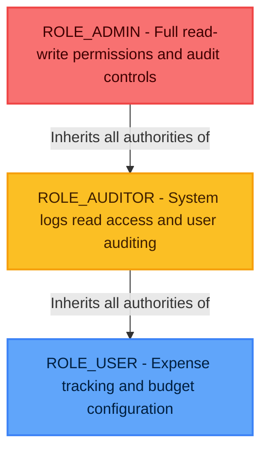
```mermaid
graph TD
    ROLE_ADMIN["ROLE_ADMIN - Full read-write permissions and audit controls"]
    ROLE_AUDITOR["ROLE_AUDITOR - System logs read access and user auditing"]
    ROLE_USER["ROLE_USER - Expense tracking and budget configuration"]

    ROLE_ADMIN -- "Inherits all authorities of" --> ROLE_AUDITOR
    ROLE_AUDITOR -- "Inherits all authorities of" --> ROLE_USER

    style ROLE_ADMIN fill:#f87171,stroke:#ef4444,stroke-width:2px,color:#3f0000
    style ROLE_AUDITOR fill:#fbbf24,stroke:#f59e0b,stroke-width:2px,color:#3f1f00
    style ROLE_USER fill:#60a5fa,stroke:#3b82f6,stroke-width:2px,color:#001f3f
```

## Backend Role Hierarchy Configuration
A `RoleHierarchy` bean is configured in the Spring Security context to automatically parse role mappings.

```java
@Bean
public RoleHierarchy roleHierarchy() {
    RoleHierarchyImpl roleHierarchy = new RoleHierarchyImpl();
    roleHierarchy.setHierarchy("ROLE_ADMIN > ROLE_AUDITOR\nROLE_AUDITOR > ROLE_USER");
    return roleHierarchy;
}
```

---

### Architectural Evaluation
* **Why it exists**: The hierarchy eliminates the need to assign dozens of duplicate permissions to higher-level roles.
* **How it works**: When a user attempts to execute a resource requiring `ROLE_USER` permissions, the security engine evaluates the hierarchy, granting access if the user holds `ROLE_AUDITOR` or `ROLE_ADMIN`.
* **Why it is scalable**: Adding new permissions to the `ROLE_USER` role automatically extends them to higher roles, eliminating the need for database updates.
* **Why it is secure**: The hierarchy maintains clear permission boundaries, reducing access configuration errors.
* **Why it is maintainable**: The entire hierarchy structure is defined in a single security bean, simplifying configuration audits.

---

# 9. Database ER Diagram

The PostgreSQL relational database is configured in Third Normal Form (3NF) to guarantee transactional integrity and record normalization.

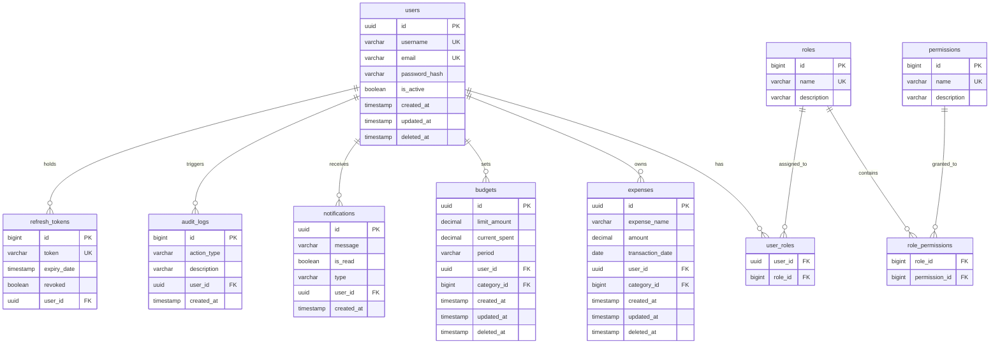
```mermaid
erDiagram
    users {
        uuid id PK
        varchar username UK
        varchar email UK
        varchar password_hash
        boolean is_active
        timestamp created_at
        timestamp updated_at
        timestamp deleted_at
    }

    roles {
        bigint id PK
        varchar name UK
        varchar description
    }

    permissions {
        bigint id PK
        varchar name UK
        varchar description
    }

    user_roles {
        uuid user_id FK
        bigint role_id FK
    }

    role_permissions {
        bigint role_id FK
        bigint permission_id FK
    }

    expenses {
        uuid id PK
        varchar expense_name
        decimal amount
        date transaction_date
        uuid user_id FK
        bigint category_id FK
        timestamp created_at
        timestamp updated_at
        timestamp deleted_at
    }

    budgets {
        uuid id PK
        decimal limit_amount
        decimal current_spent
        varchar period
        uuid user_id FK
        bigint category_id FK
        timestamp created_at
        timestamp updated_at
        timestamp deleted_at
    }

    notifications {
        uuid id PK
        varchar message
        boolean is_read
        varchar type
        uuid user_id FK
        timestamp created_at
    }

    audit_logs {
        bigint id PK
        varchar action_type
        varchar description
        uuid user_id FK
        timestamp created_at
    }

    refresh_tokens {
        bigint id PK
        varchar token UK
        timestamp expiry_date
        boolean revoked
        uuid user_id FK
    }

    users ||--o{ user_roles : has
    roles ||--o{ user_roles : assigned_to
    roles ||--o{ role_permissions : contains
    permissions ||--o{ role_permissions : granted_to
    users ||--o{ expenses : owns
    users ||--o{ budgets : sets
    users ||--o{ notifications : receives
    users ||--o{ audit_logs : triggers
    users ||--o{ refresh_tokens : holds
```

## Relational Design Specifications
* **UUID Keying**: Primary identifiers for users, expenses, and budgets use UUID v4 values. This prevents sequential ID enumeration attacks.
* **Constraints and Indexes**: Foreign keys preserve referential integrity, and composite indexes (e.g., `user_id` + `transaction_date` on `expenses`) optimize query response times.
* **Soft Deletes**: Soft deletes are implemented using a `deleted_at` timestamp column to retain historical data for audit trail compliance.

---

### Architectural Evaluation
* **Why it exists**: Normalization and referential integrity prevent data corruption and orphan records, which is critical for financial ledger accuracy.
* **How it works**: Tables enforce relational integrity, and join tables map many-to-many associations between roles and permissions.
* **Why it is scalable**: UUIDs eliminate write serialization bottlenecks that occur with sequential primary keys, supporting concurrent database writes.
* **Why it is secure**: The separation of authentication and business tables isolates sensitive credential fields.
* **Why it is maintainable**: Standardized tables map directly to Java JPA entities, minimizing custom ORM configurations.

---

# 10. Expense Management Workflow

Creating a new expense record initiates a workflow that includes DTO validation, real-time budget threshold checks, and audit logging.

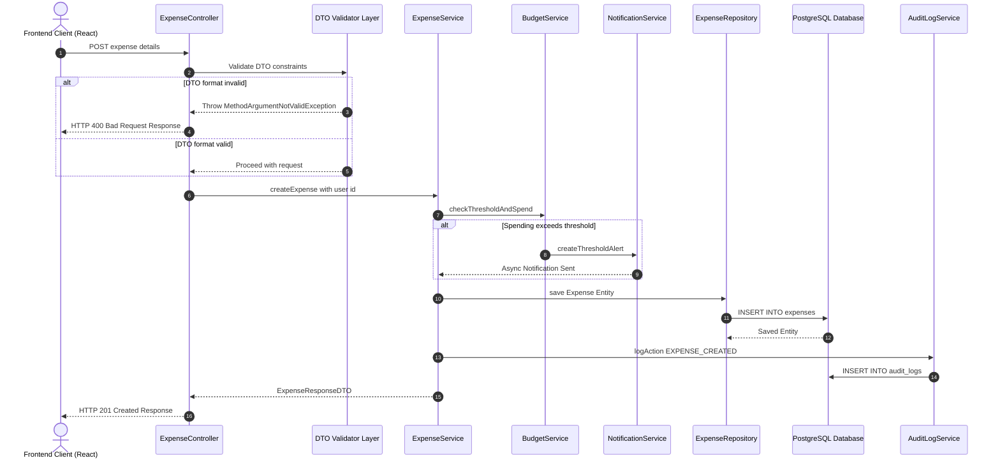
```mermaid
sequenceDiagram
    autonumber
    actor Client as Frontend Client (React)
    participant Controller as ExpenseController
    participant Validator as DTO Validator Layer
    participant Service as ExpenseService
    participant BudgetService as BudgetService
    participant Notif as NotificationService
    participant Repo as ExpenseRepository
    participant DB as PostgreSQL Database
    participant Audit as AuditLogService

    Client->>Controller: POST expense details
    Controller->>Validator: Validate DTO constraints
    alt DTO format invalid
        Validator-->>Controller: Throw MethodArgumentNotValidException
        Controller-->>Client: HTTP 400 Bad Request Response
    else DTO format valid
        Validator-->>Controller: Proceed with request
    end
    Controller->>Service: createExpense with user id
    Service->>BudgetService: checkThresholdAndSpend
    alt Spending exceeds threshold
        BudgetService->>Notif: createThresholdAlert
        Notif-->>Service: Async Notification Sent
    end
    Service->>Repo: save Expense Entity
    Repo->>DB: INSERT INTO expenses
    DB-->>Repo: Saved Entity
    Service->>Audit: logAction EXPENSE_CREATED
    Audit->>DB: INSERT INTO audit_logs
    Service-->>Controller: ExpenseResponseDTO
    Controller-->>Client: HTTP 201 Created Response
```

## Workflow Execution Steps
1. **Payload Entry**: The client submits a POST request containing the new expense details.
2. **DTO Constraint Checking**: Spring validates that fields are populated and match formatting constraints before routing to the controller.
3. **Threshold Calculation**: The service queries the budget table, calculating whether adding the expense exceeds the user's category budget.
4. **Asynchronous Notification**: If the budget is exceeded, a notification event is dispatched to trigger an alert.
5. **Persistence**: The database inserts the record, commits the transaction, and writes a log to the audit table.

---

### Architectural Evaluation
* **Why it exists**: Validating and verifying budgets at the controller boundary prevents invalid data from entering database transactions.
* **How it works**: Incoming requests are validated, checked against budget limits, persisted to the database, and logged in the audit trail.
* **Why it is scalable**: Database writes are wrapped in transactional blocks, ensuring safe rollbacks if database connections fail.
* **Why it is secure**: The backend extracts the user's ID from the validated security context, preventing users from logging expenses to other accounts.
* **Why it is maintainable**: Separating validation from business services simplifies updates to validation rules.

---

# 11. Async Email System

The notification infrastructure processes outgoing email transmissions asynchronously, preventing network latency from blocking the main request thread.

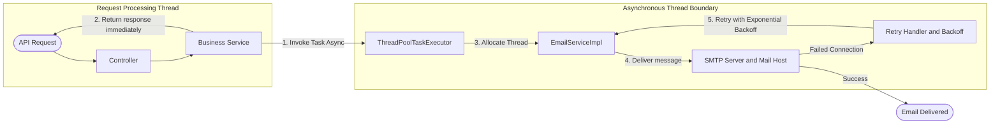
```mermaid
flowchart LR
    subgraph CoreRequest [Request Processing Thread]
        UserReq([API Request]) --> Controller[Controller]
        Controller --> Service[Business Service]
    end

    subgraph AsyncExecution [Asynchronous Thread Boundary]
        Executor[ThreadPoolTaskExecutor]
        EmailService[EmailServiceImpl]
        SMTP[SMTP Server and Mail Host]
        RetryHandler[Retry Handler and Backoff]
    end

    Service -- "1. Invoke Task Async" --> Executor
    Service -- "2. Return response immediately" --> UserReq
    Executor -- "3. Allocate Thread" --> EmailService
    EmailService -- "4. Deliver message" --> SMTP
    SMTP -- "Failed Connection" --> RetryHandler
    RetryHandler -- "5. Retry with Exponential Backoff" --> EmailService
    SMTP -- "Success" --> Delivered([Email Delivered])
```

## Executor Configurations
* **ThreadPoolTaskExecutor Config**:
  * Core Pool Size: `10`
  * Max Pool Size: `50`
  * Queue Capacity: `1000`
* **Retry and Backoff**: Mail delivery failures are caught by a retry handler, which reschedules the task with exponential backoff rather than throwing runtime errors.

---

### Architectural Evaluation
* **Why it exists**: SMTP delivery times are variable. Running mail dispatch synchronously would degrade application responsiveness for users.
* **How it works**: Annotating methods with `@Async` instructs Spring to execute the task in a dedicated thread pool, letting the client request return immediately.
* **Why it is scalable**: Decoupling network-bound operations prevents thread exhaustion in the web server, allowing it to handle more concurrent users.
* **Why it is secure**: Isolating mail processing prevents errors in third-party services from disrupting the core application.
* **Why it is maintainable**: Mail properties and thread configurations are set in centralized properties files, simplifying infrastructure updates.

---

# 12. Scheduler Architecture

The system uses background schedulers to perform housekeeping tasks, keeping database tables clean.

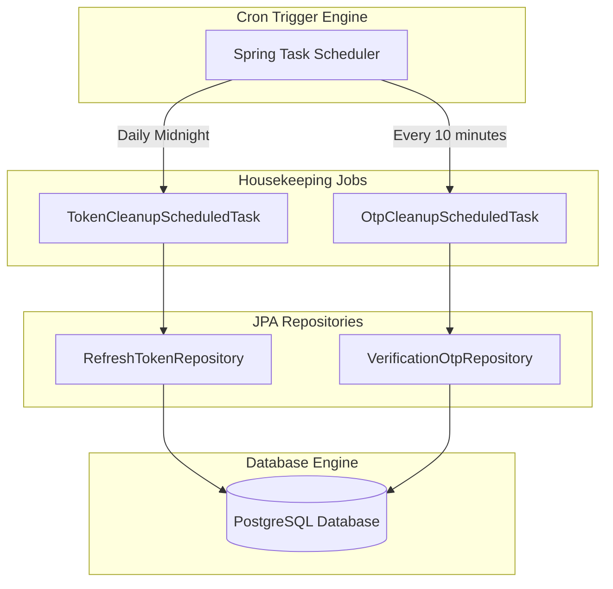
```mermaid
flowchart TD
    subgraph CronTrigger [Cron Trigger Engine]
        Scheduler[Spring Task Scheduler]
    end

    subgraph JobRegistry [Housekeeping Jobs]
        CleanTokens["TokenCleanupScheduledTask"]
        CleanOtps["OtpCleanupScheduledTask"]
    end

    subgraph DatabaseAccess [JPA Repositories]
        RefreshRepo["RefreshTokenRepository"]
        OtpRepo["VerificationOtpRepository"]
    end

    subgraph Storage [Database Engine]
        Postgres[(PostgreSQL Database)]
    end

    Scheduler -- "Daily Midnight" --> CleanTokens
    Scheduler -- "Every 10 minutes" --> CleanOtps
    CleanTokens --> RefreshRepo
    CleanOtps --> OtpRepo
    RefreshRepo --> Postgres
    OtpRepo --> Postgres
```

## Scheduled Tasks
* **Expired Token Cleanup**: Runs daily at midnight to delete expired refresh tokens, keeping the database optimized.
* **Expired OTP Deletion**: Runs every 10 minutes to remove expired one-time passwords from the validation table.

---

### Architectural Evaluation
* **Why it exists**: Expired tokens and OTPs serve no purpose post-expiration. Periodic deletion keeps database storage optimized.
* **How it works**: The scheduler triggers queries at set intervals, identifying and removing expired records directly from the database.
* **Why it is scalable**: Running cleanup tasks in the background avoids resource competition during peak business hours.
* **Why it is secure**: Removing expired secrets reduces the surface area for replay attacks and token exploits.
* **Why it is maintainable**: Job timing rules are defined via externalized cron parameters, allowing schedulers to be adjusted without code modifications.

---

# 13. Frontend Route Protection

The frontend Router implements declarative navigation guards, protecting routes on the client side before rendering components.

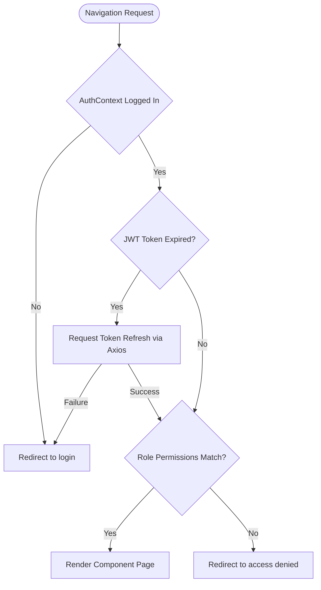
```mermaid
flowchart TD
    RouteReq([Navigation Request]) --> AuthCheck{AuthContext Logged In}
    
    AuthCheck -- No --> RedirectLogin[Redirect to login]
    AuthCheck -- Yes --> TokenCheck{JWT Token Expired?}
    
    TokenCheck -- Yes --> RefreshToken[Request Token Refresh via Axios]
    RefreshToken -- Success --> PermissionsCheck{Role Permissions Match?}
    RefreshToken -- Failure --> RedirectLogin
    
    TokenCheck -- No --> PermissionsCheck
    
    PermissionsCheck -- Yes --> RenderView[Render Component Page]
    PermissionsCheck -- No --> RedirectDenied[Redirect to access denied]
```

## Route Guard Logic
* **PrivateRoute Wrapper**: Confirms the user is authenticated before mounting child views.
* **ProtectedRoute Wrapper**: Evaluates user permissions against route constraints, preventing access to restricted administrative views.

---

### Architectural Evaluation
* **Why it exists**: It prevents users from viewing screens they are unauthorized to access, improving usability and frontend isolation.
* **How it works**: If a route matches a guard, the application evaluates the in-memory JWT. If expired, it triggers a refresh action; if unauthorized, it redirects to the access-denied page.
* **Why it is scalable**: Route validation is handled locally on the client, avoiding unnecessary backend hits for static navigation.
* **Why it is secure**: It acts as the first line of defense, ensuring that restricted tools (like user edit forms) are never loaded into the client DOM.
* **Why it is maintainable**: Route structures are declared in a centralized routing file using standard protective component wrappers.

---

# 14. Admin Dashboard Architecture

The Admin dashboard consolidates user management, role editing, and system log auditing into a secure module.

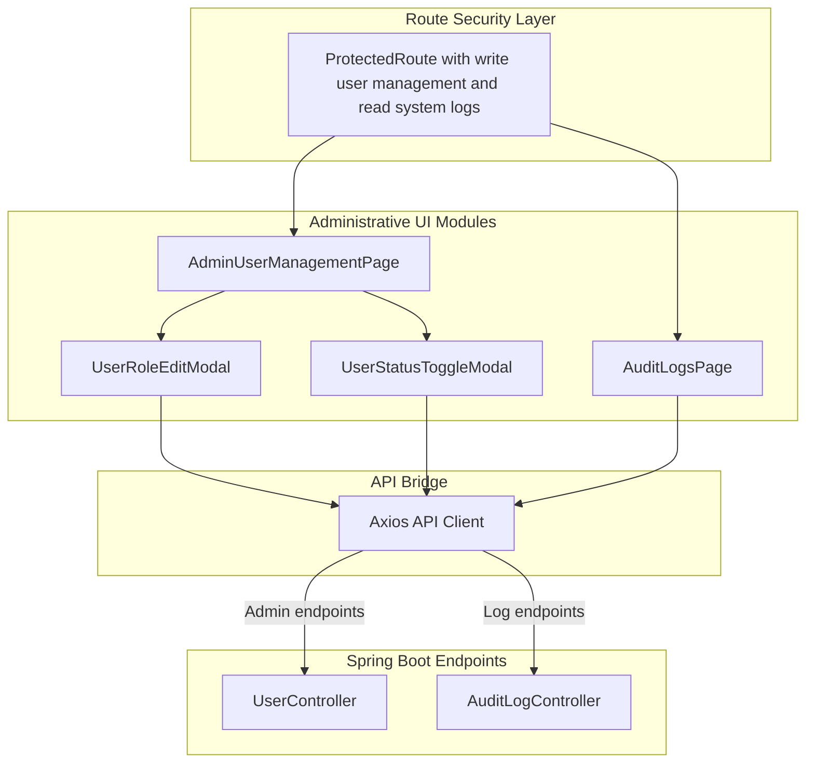
```mermaid
graph TD
    subgraph RouteProtection [Route Security Layer]
        AdminRoute[ProtectedRoute with write user management and read system logs]
    end

    subgraph DashboardUI [Administrative UI Modules]
        AdminUserPage[AdminUserManagementPage]
        AuditPage[AuditLogsPage]
        RoleEdit[UserRoleEditModal]
        StatusToggle[UserStatusToggleModal]
    end

    subgraph FrontEndServices [API Bridge]
        Client[Axios API Client]
    end

    subgraph BackEndControllers [Spring Boot Endpoints]
        UserCtrl[UserController]
        AuditCtrl[AuditLogController]
    end

    AdminRoute --> AdminUserPage
    AdminRoute --> AuditPage
    AdminUserPage --> RoleEdit
    AdminUserPage --> StatusToggle
    RoleEdit --> Client
    StatusToggle --> Client
    AuditPage --> Client
    Client -- "Admin endpoints" --> UserCtrl
    Client -- "Log endpoints" --> AuditCtrl
```

## Dashboard Features
* **User Management**: Allows administrators to edit user roles, lock accounts, or toggle account status.
* **Audit Trail Auditing**: Renders system logs dynamically, enabling search and filter operations by action type or username.

---

### Architectural Evaluation
* **Why it exists**: Admin tooling requires distinct security configurations. Separating these tools reduces the risk of accidental exposure to standard users.
* **How it works**: The admin route loads admin views, which query endpoints protected on the backend by `@PreAuthorize` guards.
* **Why it is scalable**: Heavy queries, like system log auditing, support server-side pagination, keeping database memory usage low.
* **Why it is secure**: All actions (like changing roles or disabling accounts) write to the audit log, ensuring complete administrative traceability.
* **Why it is maintainable**: Using dedicated controllers for user and audit logs prevents the main expense controllers from becoming bloated.

---

# 15. Complete Request Lifecycle

This sequence trace details how a client request flows through the application's layers from client submission to database write.

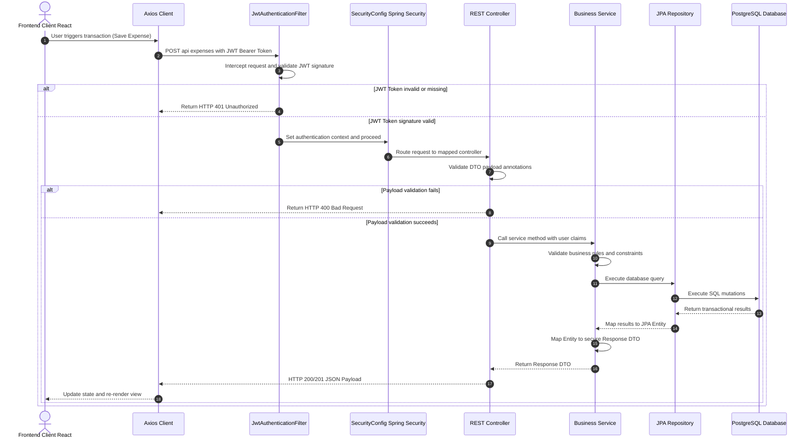
```mermaid
sequenceDiagram
    autonumber
    actor Browser as Frontend Client React
    participant Axios as Axios Client
    participant Filter as JwtAuthenticationFilter
    participant Security as SecurityConfig Spring Security
    participant Controller as REST Controller
    participant Service as Business Service
    participant Repo as JPA Repository
    participant DB as PostgreSQL Database

    Browser->>Axios: User triggers transaction (Save Expense)
    Axios->>Filter: POST api expenses with JWT Bearer Token
    Filter->>Filter: Intercept request and validate JWT signature
    alt JWT Token invalid or missing
        Filter-->>Axios: Return HTTP 401 Unauthorized
    else JWT Token signature valid
        Filter->>Security: Set authentication context and proceed
        Security->>Controller: Route request to mapped controller
        Controller->>Controller: Validate DTO payload annotations
        alt Payload validation fails
            Controller-->>Axios: Return HTTP 400 Bad Request
        else Payload validation succeeds
            Controller->>Service: Call service method with user claims
            Service->>Service: Validate business rules and constraints
            Service->>Repo: Execute database query
            Repo->>DB: Execute SQL mutations
            DB-->>Repo: Return transactional results
            Repo-->>Service: Map results to JPA Entity
            Service->>Service: Map Entity to secure Response DTO
            Service-->>Controller: Return Response DTO
            Controller-->>Axios: HTTP 200/201 JSON Payload
            Axios-->>Browser: Update state and re-render view
        end
    end
```

## Execution Steps
1. **Network Request**: Axios.request transmits payload.
2. **Security Checks**: Filter intercepts and decrypts tokens.
3. **Control Routing**: Controller checks annotations.
4. **Service Persistence**: Domain models compile and execute transactions.

---

### Architectural Evaluation
* **Why it exists**: This pipeline enforces validation and authentication at every step of a request's lifecycle.
* **How it works**: Requests pass through interceptors, controllers, services, repositories, and databases, with validations running at each step.
* **Why it is scalable**: The application handles request validation and authentication processing in memory, minimizing database query loads.
* **Why it is secure**: Invalid requests are rejected early in the pipeline, reducing processing overhead.
* **Why it is maintainable**: Each class in the pipeline has a single responsibility, simplifying testing and debugging.

---

# 16. Security Architecture

The application implements defense-in-depth, layering security controls at the network, authentication, and database levels.

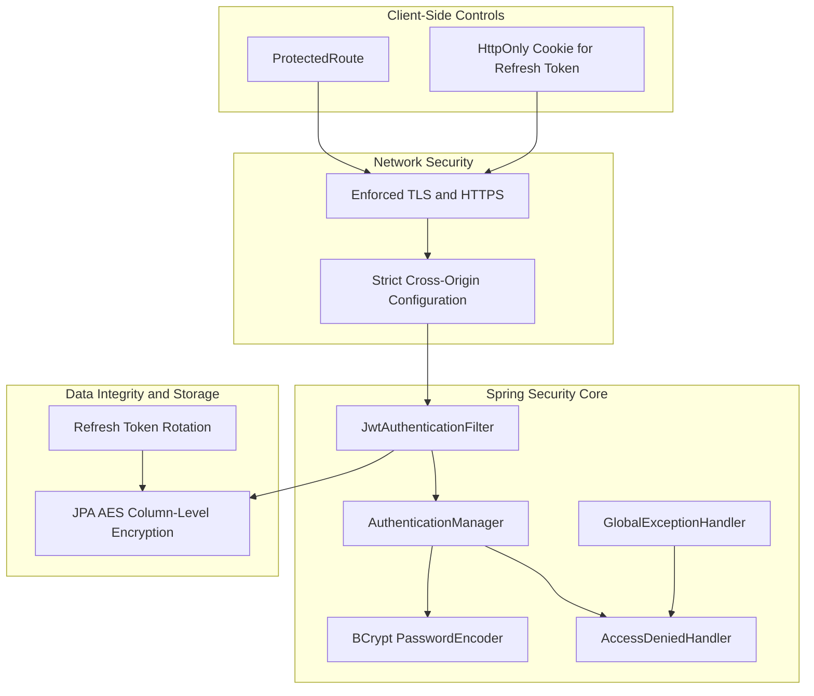
```mermaid
graph TD
    subgraph ClientProtection [Client-Side Controls]
        RouteGuard[ProtectedRoute]
        CookieStorage[HttpOnly Cookie for Refresh Token]
    end

    subgraph NetworkProtection [Network Security]
        HttpsOnly[Enforced TLS and HTTPS]
        CorsConfig[Strict Cross-Origin Configuration]
    end

    subgraph SpringSecurity [Spring Security Core]
        JwtFilter[JwtAuthenticationFilter]
        AuthMgr[AuthenticationManager]
        BCrypt[BCrypt PasswordEncoder]
        AccessDenied[AccessDeniedHandler]
        GlobalException[GlobalExceptionHandler]
    end

    subgraph DataIntegrity [Data Integrity and Storage]
        RTR[Refresh Token Rotation]
        JPAAes[JPA AES Column-Level Encryption]
    end

    RouteGuard --> HttpsOnly
    CookieStorage --> HttpsOnly
    HttpsOnly --> CorsConfig
    CorsConfig --> JwtFilter
    JwtFilter --> AuthMgr
    AuthMgr --> BCrypt
    AuthMgr --> AccessDenied
    JwtFilter --> JPAAes
    GlobalException --> AccessDenied
    RTR --> JPAAes
```

## Security Protocols
* **CORS Policy**: Configured to restrict access, permitting requests only from authorized frontend domains.
* **JPA Attribute Encryption**: Encrypts sensitive database columns (e.g., specific user details) at rest using AES-256 encryption.
* **BCrypt Hashing**: Hashes passwords using BCrypt with a work factor of 12 before database write.

---

### Architectural Evaluation
* **Why it exists**: A single security flaw can expose corporate financial records. Defense-in-depth ensures the system remains secure even if one component is compromised.
* **How it works**: CORS blocks unauthorized domains, filters authenticate tokens, Spring Security guards methods, and JPA encrypts database writes.
* **Why it is scalable**: Security checks are performed in-memory during request validation, keeping performance high.
* **Why it is secure**: Sensitive records are encrypted at rest, protecting data even if database snapshots are compromised.
* **Why it is maintainable**: Standardized security configurations simplify system audits and updates.

---

# 17. Project Features

The application provides a comprehensive suite of expense tracking and management features for enterprise environments.

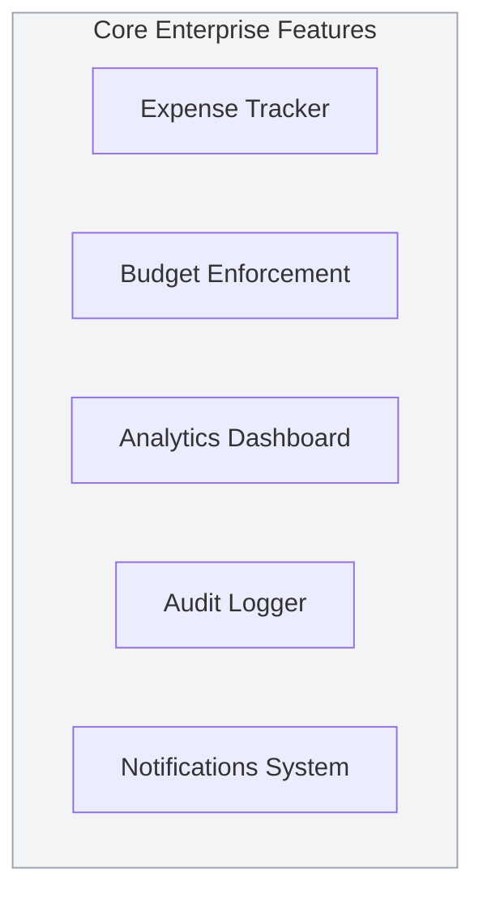
```mermaid
graph TD
    subgraph Features [Core Enterprise Features]
        ExpenseTracking[Expense Tracker]
        BudgetEnforce[Budget Enforcement]
        Analytics[Analytics Dashboard]
        Audit[Audit Logger]
        NotificationSystem[Notifications System]
    end
    style Features fill:#f3f4f6,stroke:#9ca3af
```

* **Expense Tracking**: Allows users to log and categorize expenses with support for attachments and notes.
* **Budget Management**: Enables users to set category limits and receive alerts when spending approaches thresholds.
* **Analytics Dashboard**: Generates charts and summaries, providing insights into spending patterns.
* **Audit Trail**: Logs all system activity, providing administrators with historical traceability.
* **Async Notifications**: Dispatches automated email alerts when budgets are exceeded or roles change.

---

### Architectural Evaluation
* **Why it exists**: The feature set is tailored to enterprise tracking needs, replacing manual logging processes.
* **How it works**: Interactive frontend components collect user actions, which are processed by backend services and saved to the database.
* **Why it is scalable**: Analytics calculations support pagination, keeping database memory usage low.
* **Why it is secure**: Feature access is governed by RBAC, ensuring users see only authorized screens.
* **Why it is maintainable**: Features are modular, enabling developers to update components independently.

---

# 18. Security Features

The platform implements security controls to protect enterprise financial and user data.

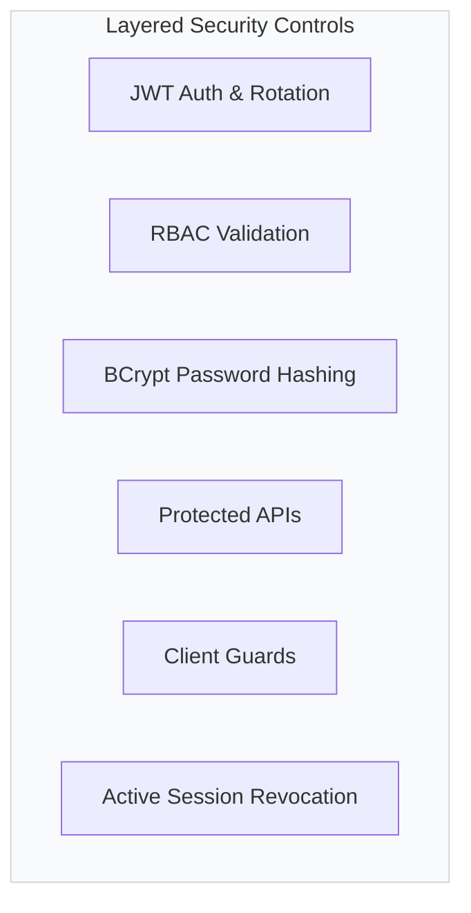
```mermaid
graph TD
    subgraph SecFeatures [Layered Security Controls]
        JWTAuth[JWT Auth & Rotation]
        RBACAuth[RBAC Validation]
        PasswordHash[BCrypt Password Hashing]
        SecureAPIs[Protected APIs]
        RouteGuards[Client Guards]
        SessionControl[Active Session Revocation]
    end
    style SecFeatures fill:#f9fafb,stroke:#d1d5db
```

* **JWT & Rotation**: The dual-token structure prevents token theft, rotating tokens during refresh calls.
* **RBAC Authorization**: Granular permissions restrict access at the controller and method level.
* **BCrypt Hashing**: Password records are hashed using BCrypt before persistence.
* **Protected APIs**: Endpoints enforce security checks, rejecting unauthenticated requests.
* **Route Guards**: Prevent unauthorized users from loading restricted frontend screens.
* **Active Session Revocation**: Allows administrators to revoke sessions by setting refresh tokens to revoked.

---

### Architectural Evaluation
* **Why it exists**: Financial applications require strict data protection, preventing unauthorized access and modifications.
* **How it works**: Spring Security filters inspect request headers, verifying tokens and permissions against configured security rules.
* **Why it is scalable**: Security verification relies on cryptographic checks in memory, reducing database lookup overhead.
* **Why it is secure**: The database-backed token registry allows administrators to invalidate user sessions instantly.
* **Why it is maintainable**: Security controls are declared using standard configurations, simplifying compliance audits.

---

# 19. Performance Optimization

The application implements performance optimizations to ensure responsiveness under high traffic loads.

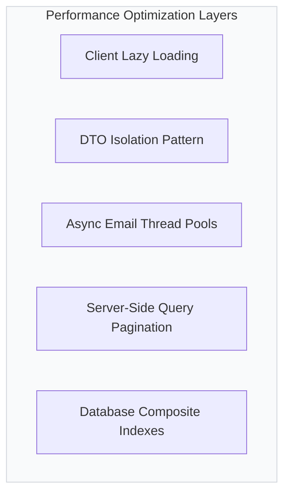
```mermaid
graph TD
    subgraph OptLayers [Performance Optimization Layers]
        LazyLoad[Client Lazy Loading]
        DtoIsolation[DTO Isolation Pattern]
        AsyncProc[Async Email Thread Pools]
        Pagination[Server-Side Query Pagination]
        Indexing[Database Composite Indexes]
    end
    style OptLayers fill:#f9fafb,stroke:#d1d5db
```

* **Client Lazy Loading**: Reduces frontend initial load times by splitting code bundles and loading them on demand.
* **DTO Isolation**: Prevents internal database schemas from leaking, reducing serialization payloads.
* **Async Email Processing**: Uses a core-size thread pool to run mail operations in the background.
* **Query Pagination**: Server-side pagination limits payload sizes, preventing memory usage spikes.
* **Database Indexes**: Indexes on fields like user_id and transaction_date optimize query speeds.

---

### Architectural Evaluation
* **Why it exists**: Financial reports can generate heavy database queries. Optimizations prevent database resource saturation.
* **How it works**: Static assets are split on the client, database queries are indexed and paginated, and non-blocking tasks run in background threads.
* **Why it is scalable**: Asynchronous processing prevents server threads from blocking, supporting higher concurrent user volumes.
* **Why it is secure**: Pagination prevents denial-of-service attempts that try to overload memory by querying massive datasets.
* **Why it is maintainable**: Optimizations are configured in centralized properties files, simplifying performance tuning.

---

# 20. Folder Structure

The project enforces clean directory division, decoupling frontend user interface code from backend Spring Boot logic.


```mermaid
graph TD
    root["Daily Expense and Budget Logger Root"]
    root --> frontend["frontend src"]
    root --> backend["backend src"]

    frontend --> fePages["pages - Dashboard, Expenses, Budgets"]
    frontend --> feComponents["components - common, Layouts, Sidebar"]
    frontend --> feContext["context - AuthContext, ThemeContext"]
    frontend --> feServices["services - Axios API wrappers"]
    frontend --> feHooks["hooks - useAuth, useNotification"]
    frontend --> feUtils["utils - tokenHelpers, formatters"]

    backend --> beConfig["config - Async, Scheduler configs"]
    backend --> beSecurity["security - JWT Filter, Configs"]
    backend --> beControllers["controller - REST APIs"]
    backend --> beDtos["dto - Request and Response Transfer Objects"]
    backend --> beModel["model - JPA Database Entities"]
    backend --> beRepos["repository - Spring Data JPA"]
    backend --> beService["service - Business Logic implementations"]
    backend --> beException["exception - Custom error Handlers"]
```

## Directory Responsibilities
* **Frontend Pages**: Component routes are mapped directly to screen files (e.g., `DashboardPage.jsx`).
* **Frontend Components**: Reusable UI elements are isolated inside common folders.
* **Backend Security**: Configuration classes, JWT filters, and permission definitions are isolated in a security package.
* **Backend Domain Models**: Entities, DTOs, and repositories are organized in distinct layers.

---

### Architectural Evaluation
* **Why it exists**: Clean project structure simplifies navigation and prevents code fragmentation.
* **How it works**: Code elements are grouped by functional responsibility, ensuring dependencies flow in a predictable direction.
* **Why it is scalable**: The file structure separates backend modules, supporting the isolation of features if the app is split into microservices.
* **Why it is secure**: Isolating security logic in a dedicated package reduces the risk of accidental modification.
* **Why it is maintainable**: Modifying a UI layout requires edits only in the frontend directories, leaving backend API interfaces unaffected.

---

# 21. Testing & Verification

The application verification suite employs automated tests and build pipelines to validate code changes and maintain quality.

```mermaid
graph TD
    subgraph TestingPyramid [Testing & Verification Pyramid]
        PlaywrightE2E["Playwright - End-to-End User Journeys"]
        MockMvcIntegration["Spring MockMvc - API Integration"]
        JUnitMockito["JUnit 5 and Mockito - Unit Level"]
    end
    PlaywrightE2E --> MockMvcIntegration
    MockMvcIntegration --> JUnitMockito
```

## Testing Suites
* **Backend Unit Tests**: Built with JUnit 5 and Mockito, isolating services and testing utility methods.
* **Integration Tests**: Execute via Spring Boot Test, testing database operations and security filters.
* **Frontend Component Tests**: Ran with Vitest, validating component interactions in virtual environments.
* **E2E Tests**: Driven by Playwright, executing user journeys from registration to expense logging.

## Verification Commands
* **Execute Backend Unit & Integration Tests**:
  ```bash
  ./mvnw test
  ```
  *Runs the test suite, verifying operations like `testForgotPasswordAndResetPasswordFlow` and `testBudgetCrudAndOwnershipAndAnalytics`.*
* **Build Frontend Assets**:
  ```bash
  npm run build
  ```
  *Compiles and optimizes React files, generating the static production bundle.*
* **Run Frontend Linter**:
  ```bash
  npm run lint
  ```
  *Checks source code against configured styling rules.*
* **Execute Vitest Component Tests**:
  ```bash
  npm run test:vitest
  ```
  *Executes component unit tests, validating presentational logic.*
* **Run Playwright E2E Tests**:
  ```bash
  npx playwright test
  ```
  *Runs end-to-end integration tests, checking user registration, login, and budget threshold flows.*

---

### Architectural Evaluation
* **Why it exists**: The verification pipeline ensures new updates do not break existing functionality or security rules.
* **How it works**: Tests are triggered locally or within CI/CD pipelines, confirming that application logic matches expected behaviors.
* **Why it is scalable**: Separating fast-running unit tests from slower E2E tests keeps deployment pipelines efficient.
* **Why it is secure**: The automated test suite verifies that security configurations restrict access as expected.
* **Why it is maintainable**: High test coverage enables refactoring code with confidence.

---

# 22. Final Conclusion

The **Daily Expense & Budget Logger (Enterprise Edition)** provides a robust framework for managing enterprise financial data.

```mermaid
graph TD
    subgraph EnterpriseReady [Production Readiness Dimensions]
        Scale["Stateless Architecture"]
        Secure["Defense in Depth"]
        Maintain["Decoupled Folder Structure"]
        Quality["Automated Testing Pipeline"]
    end
    style EnterpriseReady fill:#f9fafb,stroke:#d1d5db
```

## Production Readiness Summary
* **Stateless Operations**: Backend REST APIs store no user state, allowing nodes to scale horizontally behind load balancers.
* **Security Controls**: Layered security policies block unauthorized access and protect records at rest.
* **Clean Code Quality**: Clean package separations simplify locating and refactoring components.
* **Scalable Infrastructure**: Non-blocking processes, database indexes, and server-side pagination ensure responsiveness under high traffic loads.

The combination of standard backend frameworks, optimized databases, and modular frontend components makes the application a production-ready solution for enterprise expense tracking.

---
*End of ChandanRaj_DailyExpense&BudgetLogger.md Academic Submission Dossier.*
