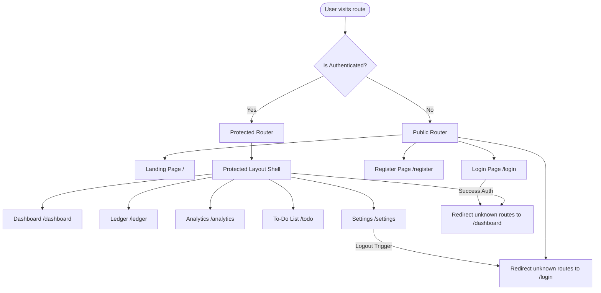

# Frontend Routing Strategy (routing_strategy.md)

## 🎯 Objectives
The primary objective of the **Frontend Routing Strategy** is to establish secure, efficient client-side routing using React Router DOM. It maps out public and protected routes, authentication gates, navigation flows, and page lazy-loading policies.

## 🔍 Scope
- **In-Scope**:
  - Declarative route declarations using React Router DOM.
  - Authentication protection wrappers (route guards).
  - Public vs. Protected layout separation.
  - Page-level lazy loading configurations.
  - Redirect rules for expired sessions.
- **Out-of-Scope**:
  - Backend controller routing.

## 🏗️ Design Decisions
1. **Protected Layout Route Wrappers**:
   - *Rationale*: Declaring authentication checks on every individual page component leads to duplicate code. Using a centralized `<ProtectedRoute>` wrapper that listens to `AuthContext` guarantees that all child routes are protected automatically.
2. **React Lazy Loading (`React.lazy()`)**:
   - *Rationale*: Loading all page bundles on the initial landing page delays application startup. Splitting pages into separate chunks loaded dynamically only when their routes are active improves initial load times.

---

## 🧭 Frontend Routing Flow (Mermaid)

---

## 💎 Advantages
- **Secure Views**: Unauthenticated users are blocked at the router layer, preventing visual components from rendering without valid tokens.
- **Improved Performance**: Code-splitting ensures users only download the javascript bundle for the page they are currently visiting.
- **Smooth Navigation**: Client-side routing avoids full-page browser refreshes, providing a fast native-like app experience.

## ⚠️ Risks & Mitigations
1. **Risk**: Page flicker or lag during code-splitting chunk downloads.
   - *Mitigation*: Wrap routes in a standard `<Suspense>` component configured with a loading skeleton screen, preventing blank page rendering.
2. **Risk**: Stale authentication state on client route changes.
   - *Mitigation*: The route guard must check the token's expiration timestamp on every route transition, triggering logout if the token has expired.

## 🚀 Future Scalability Notes
- **Role-Based Routing Gating**: The routing wrappers are designed to support role parameters (e.g. `allowedRoles={['ADMIN']}`), allowing easy integration of Role-Based Access Control (RBAC) in future phases.

## 🛠️ Best Practices
- **Use declarative redirects**: Avoid using raw window location assignments; navigate using React Router hooks (`useNavigate` / `<Navigate />`) to preserve application state.
- **Provide fallback routes**: Always declare a wildcard (`*`) catch-all route at the bottom of the routing tree to handle unknown paths.
- **Keep route setups centralized**: Declare all routes in a single entry file (`App.jsx` or a dedicated router configuration file).
