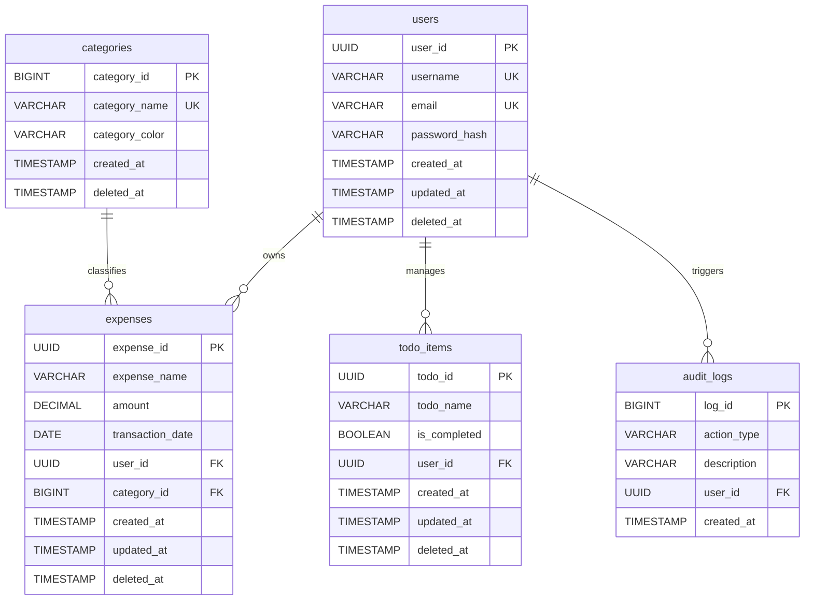

# Database Architecture & Schema Design (database_architecture.md)

## 🎯 Objectives
The primary objective of the **Database Architecture** is to define the relational data schema mapping of PostgreSQL. It outlines the table structure, data typing, relationship configurations (one-to-many, many-to-one), indexing plans to optimize search queries, and audit field integration strategies.

## 🔍 Scope
- **In-Scope**:
  - Entity relationship mappings and normalization schema (3NF compliance).
  - Database schema naming conventions.
  - Indexing rules for optimization.
  - Soft delete database strategy.
  - Future Role-Based Access Control (RBAC) database schema.
- **Out-of-Scope**:
  - Detailed server hosting configurations.

## 🏗️ Design Decisions
1. **Relational PostgreSQL Database**:
   - *Rationale*: Financial expense data requires strict ACID compliance (Atomicity, Consistency, Isolation, Durability) and structural relational linkages, making NoSQL databases unsuitable.
2. **Surrogate UUID Keys for Public Identifiers**:
   - *Rationale*: Users and expenses use UUIDs as their public API identifiers instead of auto-incrementing integers. This prevents user scanning attacks and keeps database record sizes hidden.
3. **Soft Delete Auditing fields**:
   - *Rationale*: All transactional tables must include `created_at` (timestamp), `updated_at` (timestamp), and `deleted_at` (nullable timestamp).

---

## 📊 Entity Relationship Diagram (Mermaid)

---

## 💎 Advantages
- **High Data Integrity**: PostgreSQL foreign key constraints prevent orphan records (e.g. expenses with deleted users).
- **Audit Trails**: Global log and delete timestamps enable restoration and transaction change history.
- **Optimized Queries**: Specific multi-column indexing yields sub-millisecond search execution.

## ⚠️ Risks & Mitigations
1. **Risk**: Slow search execution as the `expenses` table accumulates records.
   - *Mitigation*: Create composite indexes combining `user_id` and `transaction_date`. Enforce API pagination to limit row scans.
2. **Risk**: Orphaned category tags on expenses.
   - *Mitigation*: Set category-to-expense constraints to `ON DELETE RESTRICT`, preventing a category from being deleted if it is linked to existing expense records.

## 🚀 Future Scalability Notes
- **RBAC Schema Expansion**: A future database expansion will introduce a `roles` table and a `user_roles` join table, shifting the application from simple user isolation to structured group and role permissions.
- **Partitioning**: Split the `expenses` table horizontally by year or month based on the `transaction_date` field to keep active query sizes small.

## 🛠️ Best Practices
- **Define constraints explicitly**: Use PostgreSQL native constraint keywords (`NOT NULL`, `UNIQUE`, `CHECK`).
- **Store currency as DECIMAL/NUMERIC**: Never use float or double types for financial amounts to avoid rounding errors.
- **Use UTC timestamps**: Set default dates to UTC timezone dynamically on insertion.
