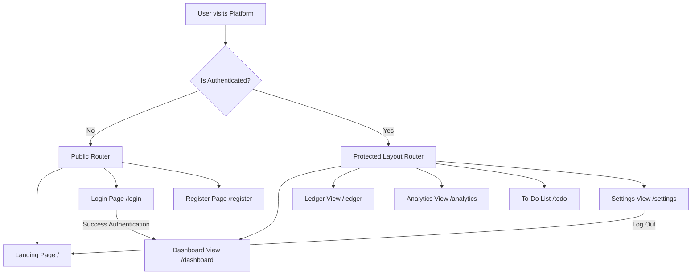

# Frontend Architecture Specification (frontend_architecture.md)

## 🎯 Objectives
The primary objective of the **Frontend Architecture** is to establish a solid foundation for the React-based client application. The architecture prioritizes a responsive, glassmorphic UI design, decoupled and reusable UI components, clear routing configurations, and type-safe HTTP communication with the backend.

## 🔍 Scope
- **In-Scope**:
  - React project organization and component hierarchy.
  - State management using the React Context API.
  - Global route declaration, including protected dashboard views and navigation gates.
  - Axios HTTP client configuration (interceptors, headers, default timeout settings).
  - CSS styling guidelines using Tailwind CSS utilities.
- **Out-of-Scope**:
  - Backend controller business logic.

## 🏗️ Design Decisions
1. **Component-Driven Atomic Organization**:
   - *Rationale*: Dividing components into `common` elements (buttons, inputs) and `layout` elements (sidebar, headers) ensures reusability. It prevents developers from repeating layout styling and simplifies UI updates.
2. **Context API for State Separation**:
   - *Rationale*: Using Context API avoids the overhead of Redux for single-user apps while keeping state modules clean (e.g. `AuthContext`, `ExpenseContext`, `ThemeContext`).
3. **Axios Client Interceptors**:
   - *Rationale*: Automates attaching the JWT authorization token (retrieved from local storage) to all outgoing HTTP headers. It also catches `401 Unauthorized` responses globally, redirecting expired sessions to the login page automatically.

---

## 🧭 Frontend Routing Flow (Mermaid)

---

## 💎 Advantages
- **Fast Page Transitions**: Direct, client-side routing (React Router DOM) ensures instant view switches.
- **Consistent Visuals**: Tailwind utility mapping ensures all buttons, layouts, inputs, and cards use identical HSL gradients, borders, and animations.
- **Low Overhead**: Context-based state provides clean isolation without the complex boilerplates of large-scale state frameworks.

## ⚠️ Risks & Mitigations
1. **Risk**: Large bundle sizes delaying the initial landing page load.
   - *Mitigation*: Leverage React Lazy Loading (`React.lazy()` and `Suspense`) to split pages (Dashboard, Ledger, Settings) into separate chunks loaded dynamically only when the route is invoked.
2. **Risk**: Storage of JWT in LocalStorage exposing it to Cross-Site Scripting (XSS) attacks.
   - *Mitigation*: Sanitize all text renders, enforce strict CSP headers on the server, and avoid rendering any raw HTML strings using React's `dangerouslySetInnerHTML`.

## 🚀 Future Scalability Notes
- **Transition to Next.js or Vite SSG**: The clean division between pages and API utilities allows the frontend project to easily migrate to framework structures like Next.js for server-side rendering (SSR) if public SEO needs expand.

## 🛠️ Best Practices
- **Never store sensitive data in global components**: Keep credentials and personal data inside isolated state contexts.
- **Enforce UI consistency**: All buttons, form elements, and loading grids must use pre-designed wrappers located in `/components/common/`.
- **Always handle loading states**: Explicitly display loading spinners or skeletons during Axios request cycles.
