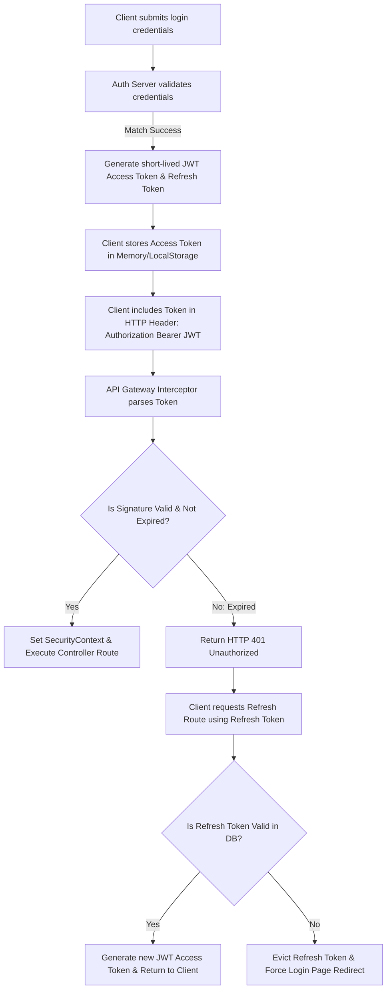

# JWT Security & Lifecycle Flow Specification (jwt_security_flow.md)

## 🎯 Objectives
The primary objective of the **JWT Security Flow** is to detail the lifecycle of JSON Web Tokens (JWT) used for session authentication. This includes token creation, payload structures, signing keys, request interception, validation steps, expiration, and future refresh token processes.

## 🔍 Scope
- **In-Scope**:
  - JWT claim parameters.
  - Secret key strength guidelines (HMAC-SHA512).
  - Validation filter intercepts.
  - Expiration and payload encryption constraints.
  - Future Refresh Token database mappings.
- **Out-of-Scope**:
  - OAuth2 provider config setup.

## 🏗️ Design Decisions
1. **Stateless Expiration (15 Minutes)**:
   - *Rationale*: JWTs are cryptographically signed and cannot be revoked without state tracking (e.g. database validation). Keeping expiration short (15 minutes) limits exposure if a token is intercepted.
2. **HMAC-SHA512 Signature Verification**:
   - *Rationale*: Leverages a 512-bit key to prevent signature brute-forcing.
3. **Database-backed Refresh Tokens (Future Integration)**:
   - *Rationale*: Allows users to stay logged in without storing long-lived access tokens on clients, using a secondary database-backed refresh token to rotate short-lived access tokens securely.

---

## 🔄 JWT Token Lifecycle (Mermaid)

---

## 💎 Advantages
- **Scales Easily**: Stateless verification reduces backend database read loads.
- **Isolates Failures**: Expired tokens are rejected at the security filter before hitting resource controllers.
- **Flexible Expiration**: Short access token windows reduce risk from token leakage.

## ⚠️ Risks & Mitigations
1. **Risk**: Storage of tokens in insecure client contexts (e.g. local storage) vulnerable to XSS.
   - *Mitigation*: Ensure the future refresh token is stored in an `httpOnly`, `secure`, `SameSite=Strict` cookie, keeping the main auth flow safe from javascript extraction.
2. **Risk**: High database write operations if validating refresh tokens.
   - *Mitigation*: Run validation checks in an in-memory database like Redis to reduce write loads on PostgreSQL.

## 🚀 Future Scalability Notes
- **JWT Blacklisting**: In later phases, a Redis-based blacklist cache will store revoked tokens until their natural expiration date, allowing instant logout support.

## 🛠️ Best Practices
- **Never include sensitive info in JWT payloads**: Forbid passwords, phone numbers, or addresses in token claims.
- **Enforce HTTPS**: Secure transport is required to prevent token sniffing.
- **Validate signature dynamically**: Verify keys on every request.
