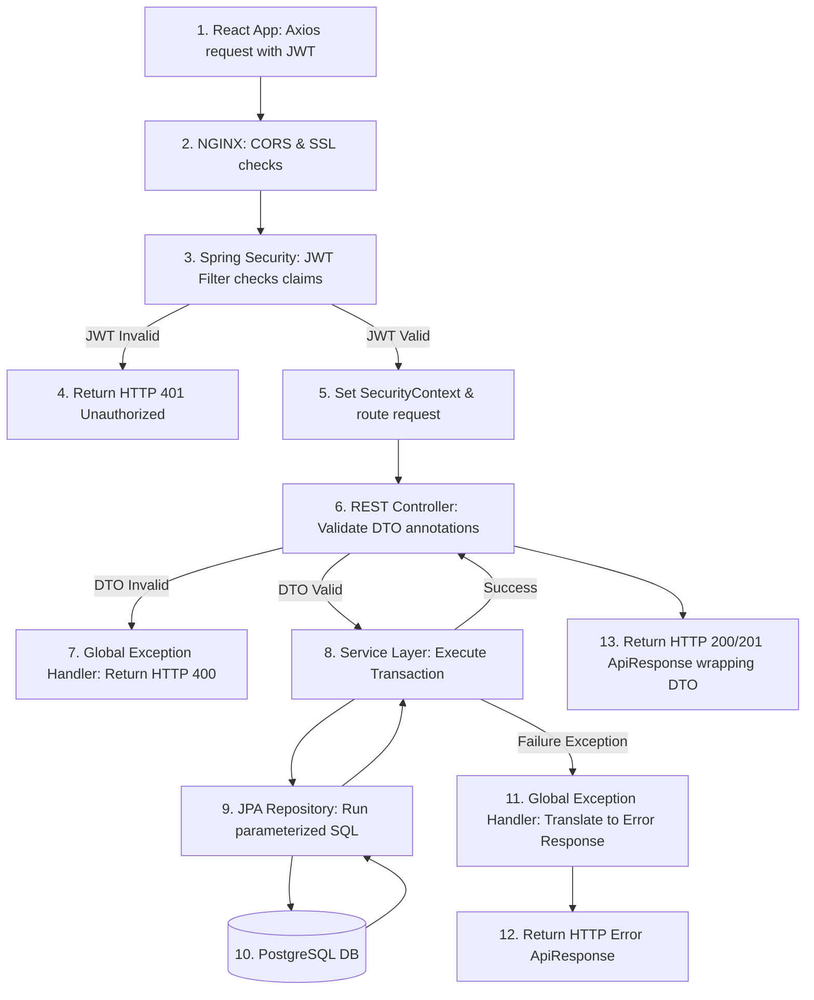

# Request Lifecycle Specification (request_lifecycle.md)

## 🎯 Objectives
The primary objective of the **Request Lifecycle Specification** is to map out the path an HTTP request travels from the React client, through NGINX, the Spring Security filter chain, controller validations, service transactions, JPA mappings, and back to the client as an envelope response.

## 🔍 Scope
- **In-Scope**:
  - Request execution sequence.
  - Proxy and routing checks.
  - Spring Security filter parsing.
  - Controller validations.
  - Service transaction boundaries.
  - Central exception mapping gates.
- **Out-of-Scope**:
  - Web client routing details.

## 🏗️ Design Decisions
1. **Stateless Interceptor Filter Chain**:
   - *Rationale*: Verifying JWT authenticity at the entry point prevents unauthorized requests from reaching controller logic, minimizing server resource usage.
2. **Explicit DTO Parameter Validation (JSR-380)**:
   - *Rationale*: Validating input parameters at the controller boundary using standard annotations prevents malformed payloads from polluting service layers or triggering database failures.

---

## 🔄 End-to-End Request Lifecycle (Mermaid)

---

## 💎 Advantages
- **Secure Boundaries**: Unauthorized requests are dropped early at the security filter layer before database queries are made.
- **Consistent Response Schema**: All responses (success or failure) use the standard `ApiResponse` envelope, simplifying client parsing.
- **Safe Database Queries**: Layered validations guarantee that database operations run only with sanitized, valid parameters.

## ⚠️ Risks & Mitigations
1. **Risk**: Blocked database connections caused by slow API operations.
   - *Mitigation*: Configure request timeout limits at the proxy gateway (NGINX) and set read timeouts on database transactions using `@Transactional(timeout = 5)`.
2. **Risk**: Broken sessions due to expired keys.
   - *Mitigation*: Implement structured token verification that catches expired keys cleanly and returns a standard `401 Unauthorized` code, triggering the client to run its token refresh routine.

## 🚀 Future Scalability Notes
- **API Gateway Routing**: As services scale, NGINX can be replaced with an API Gateway (like Spring Cloud Gateway), providing centralized routing, rate limiting, and token validation across multiple microservices.

## 🛠️ Best Practices
- **Sanitize fields early**: Enforce input length and character limits at the DTO validation layer.
- **Set read-only transactions**: Annotate read-only service operations with `@Transactional(readOnly = true)` to optimize database performance.
- **Log request lifecycle events**: Record execution times for incoming requests to identify performance bottlenecks.
