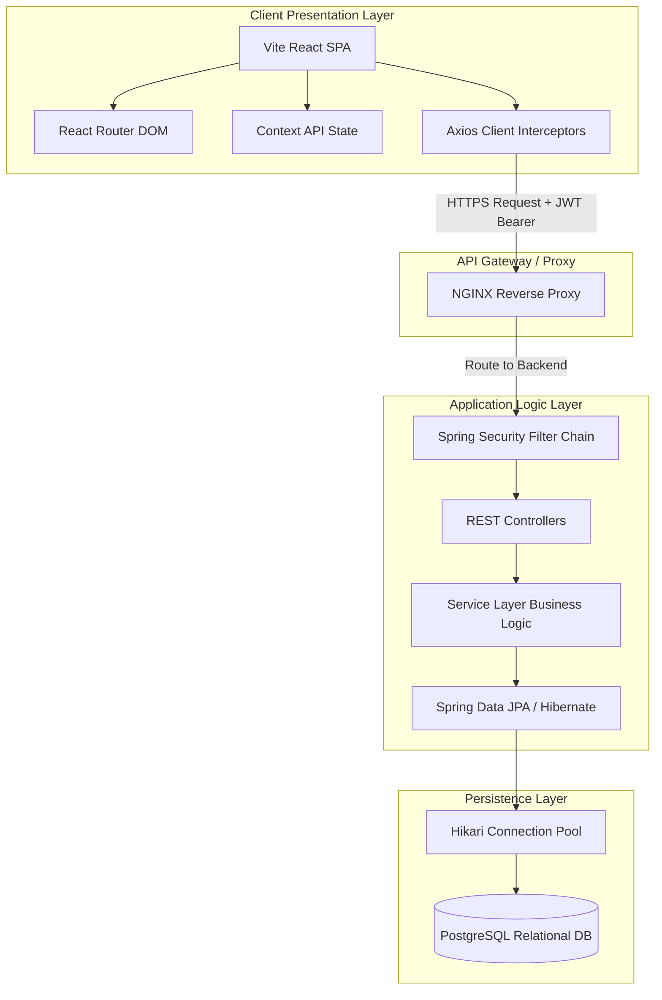

# System Design Specification (system_design.md)

## 🎯 Objectives
The primary objective of the **System Design Specification** is to document the logical and physical layout of the platform. The specification maps how components (React, Spring Boot Security, JPA Repositories, PostgreSQL) connect, exchange data, manage transactions, and isolate user records.

## 🔍 Scope
- **In-Scope**:
  - Web client runtime details.
  - Server application containers, Spring framework engines, and filters.
  - Relational Database layout and connection pooling.
  - End-to-end data lifecycle paths.
- **Out-of-Scope**:
  - Configuration of external hosting provider firewalls.

## 🏗️ Design Decisions
1. **Three-Tier Architectural Model**:
   - *Rationale*: Separation of client (Vite React), server logic (Spring Boot), and data layers (PostgreSQL) prevents changes in one tier from impacting others.
2. **Stateless Backend REST APIs**:
   - *Rationale*: Storing session states in memory restricts scaling. Stateless APIs allow horizontal scaling using a load balancer.

---

## 🖼️ Full System Topology (Mermaid)

---

## 💎 Advantages
- **Component Isolation**: Visual frontend changes do not affect backend database transaction logic.
- **Improved Security Control**: Single entrance filter chain ensures all requests are parsed for valid JWT headers and CORS policies before invoking business logic code.
- **Predictable Error Handling**: Centralized exception handler maps exceptions to standard REST errors globally.

## ⚠️ Risks & Mitigations
1. **Risk**: Latency on dashboard requests due to multiple API calls.
   - *Mitigation*: Consolidate dashboard endpoint queries into unified DTO models so the React client can render primary landing indicators via a single API request.
2. **Risk**: Database connection pool exhaustion during peak transaction periods.
   - *Mitigation*: Standardize connection pooling parameters (HikariCP) with strict timeout thresholds, and configure JPA transactional boundaries strictly using `@Transactional(readOnly = true)` for read operations to return resources quickly.

## 🚀 Future Scalability Notes
- **Load Balancing Ready**: Since the Logic Tier holds no server-side user sessions, multiple Spring Boot instances can be spawned behind a reverse proxy (e.g., NGINX) to distribute request traffic evenly.
- **Read-Write Database Splitting**: Split database traffic so read queries target read-replicas, keeping the primary PostgreSQL node available for write operations.

## 🛠️ Best Practices
- **Never trust client inputs**: Sanitization, authorization checks, and payload validation (JSR-380 annotations) are strictly enforced at the backend controller level.
- **Explicit Response Formats**: All server API outputs utilize a standard response envelope.
- **Keep configurations external**: Load secrets, URLs, and database credentials from environment variables.
