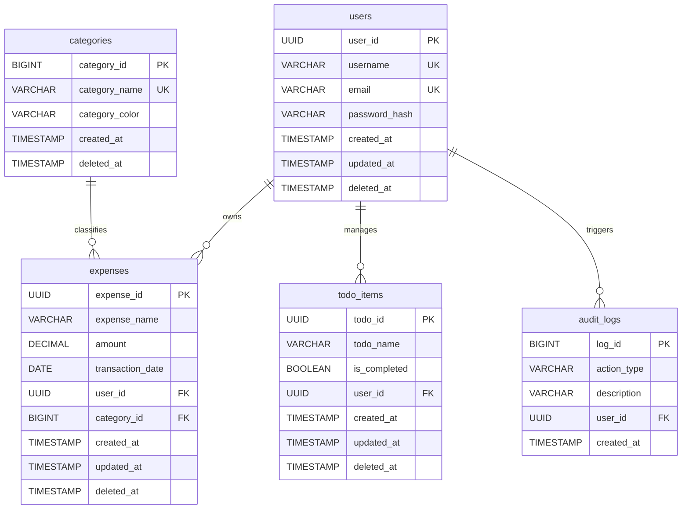

# Database Schema & Index Specification (database_planning.md)

## 🎯 Objectives
The primary objective of the **Database Schema Specification** is to detail the relational PostgreSQL database tables, fields, data types, index mappings, constraints, and audit field layouts.

## 🔍 Scope
- **In-Scope**:
  - Detailed table maps (users, categories, expenses, todo_items, audit_logs).
  - Field name definitions and SQL data types.
  - Foreign key and unique constraints.
  - Indexing optimizations for common queries.
- **Out-of-Scope**:
  - Specific cloud server hosting pricing models.

## 🏗️ Design Decisions
1. **Surrogate UUID Keys for Public Entities**:
   - *Rationale*: Tables representing core user-facing entities (users, expenses, todo_items) use UUID data types for primary keys. This prevents user ID scanning attacks and keeps database sizes hidden.
2. **Numeric Type for Financial Amounts**:
   - *Rationale*: Floating-point types (like FLOAT or DOUBLE) introduce rounding errors during math operations. Using `DECIMAL(12, 2)` (numeric type) guarantees accurate calculations.

---

## 📊 Database Relationships (Mermaid)

---

## 💎 Advantages
- **ACID Compliance**: Relational constraints ensure transaction consistency and data protection.
- **Traceable Activity**: Audit logs and soft deletes provide audit logs of all actions.
- **Fast Search Queries**: Multi-column index mapping optimizes search performance.

## ⚠️ Risks & Mitigations
1. **Risk**: Performance drops as transaction tables grow.
   - *Mitigation*: Create composite indexes combining `user_id` and `transaction_date` on the expenses table. Enforce page size limits on all ledger API requests.
2. **Risk**: Duplicate entries for soft-deleted records.
   - *Mitigation*: Configure unique indexes that check only active columns (e.g. `CREATE UNIQUE INDEX idx_user_active ON users(username) WHERE deleted_at IS NULL`).

## 🚀 Future Scalability Notes
- **RBAC Schema Mapping**: A future database expansion will introduce a `roles` table and a `user_roles` join table, shifting the application from simple user isolation to structured group and role permissions.
- **Partitioning**: Split the `expenses` table horizontally by year or month based on the `transaction_date` field to keep active query sizes small.

## 🛠️ Best Practices
- **Define constraints explicitly**: Use PostgreSQL native constraint keywords (`NOT NULL`, `UNIQUE`, `CHECK`).
- **Store currency as DECIMAL/NUMERIC**: Never use float or double types for financial amounts to avoid rounding errors.
- **Use UTC timestamps**: Set default dates to UTC timezone dynamically on insertion.

---

## 🗄️ Database Tables Definition

### 1. Table: `users`
Represents the user credentials and account details.
- `user_id`: `UUID`, Primary Key, Default: `gen_random_uuid()`.
- `username`: `VARCHAR(50)`, Not Null, Unique constraint.
- `email`: `VARCHAR(100)`, Not Null, Unique constraint.
- `password_hash`: `VARCHAR(255)`, Not Null.
- `created_at`: `TIMESTAMP`, Not Null, Default: `CURRENT_TIMESTAMP`.
- `updated_at`: `TIMESTAMP`, Not Null, Default: `CURRENT_TIMESTAMP`.
- `deleted_at`: `TIMESTAMP`, Nullable.

### 2. Table: `categories`
Represents the default and custom spending categories.
- `category_id`: `BIGSERIAL` (BigInt auto-increment), Primary Key.
- `category_name`: `VARCHAR(50)`, Not Null, Unique constraint.
- `category_color`: `VARCHAR(7)`, Not Null, Default: `#4F46E5`.
- `created_at`: `TIMESTAMP`, Not Null, Default: `CURRENT_TIMESTAMP`.
- `deleted_at`: `TIMESTAMP`, Nullable.

### 3. Table: `expenses`
Represents individual expense transactions.
- `expense_id`: `UUID`, Primary Key, Default: `gen_random_uuid()`.
- `expense_name`: `VARCHAR(100)`, Not Null.
- `amount`: `DECIMAL(12, 2)`, Not Null.
- `transaction_date`: `DATE`, Not Null.
- `user_id`: `UUID`, Foreign Key referencing `users(user_id)`, Not Null.
- `category_id`: `BIGINT`, Foreign Key referencing `categories(category_id)`, Not Null.
- `created_at`: `TIMESTAMP`, Not Null, Default: `CURRENT_TIMESTAMP`.
- `updated_at`: `TIMESTAMP`, Not Null, Default: `CURRENT_TIMESTAMP`.
- `deleted_at`: `TIMESTAMP`, Nullable.

### 4. Table: `todo_items`
Represents items in the user's shopping checklist.
- `todo_id`: `UUID`, Primary Key, Default: `gen_random_uuid()`.
- `todo_name`: `VARCHAR(100)`, Not Null.
- `is_completed`: `BOOLEAN`, Not Null, Default: `false`.
- `user_id`: `UUID`, Foreign Key referencing `users(user_id)`, Not Null.
- `created_at`: `TIMESTAMP`, Not Null, Default: `CURRENT_TIMESTAMP`.
- `updated_at`: `TIMESTAMP`, Not Null, Default: `CURRENT_TIMESTAMP`.
- `deleted_at`: `TIMESTAMP`, Nullable.

### 5. Table: `audit_logs`
Tracks key user actions and database transactions.
- `log_id`: `BIGSERIAL`, Primary Key.
- `action_type`: `VARCHAR(50)`, Not Null.
- `description`: `VARCHAR(255)`, Not Null.
- `user_id`: `UUID`, Foreign Key referencing `users(user_id)`, Nullable (allows logging system events).
- `created_at`: `TIMESTAMP`, Not Null, Default: `CURRENT_TIMESTAMP`.

---

## ⚡ Indexing Optimization Plan
To ensure sub-millisecond query execution speeds as datasets scale, we create specific database indexes:
1. **Index on User Expenses Search**:
   `CREATE INDEX idx_expenses_user_date ON expenses(user_id, transaction_date DESC) WHERE deleted_at IS NULL;`
   - *Rationale*: Ledger sorting and filtering queries retrieve active rows for a specific user sorted by date.
2. **Index on Active Users**:
   `CREATE UNIQUE INDEX idx_users_active_email ON users(email) WHERE deleted_at IS NULL;`
   - *Rationale*: Login validations perform unique searches based on active emails.
3. **Index on Active Categories**:
   `CREATE UNIQUE INDEX idx_categories_active_name ON categories(category_name) WHERE deleted_at IS NULL;`
   - *Rationale*: Category validation checks verify active names are unique.
